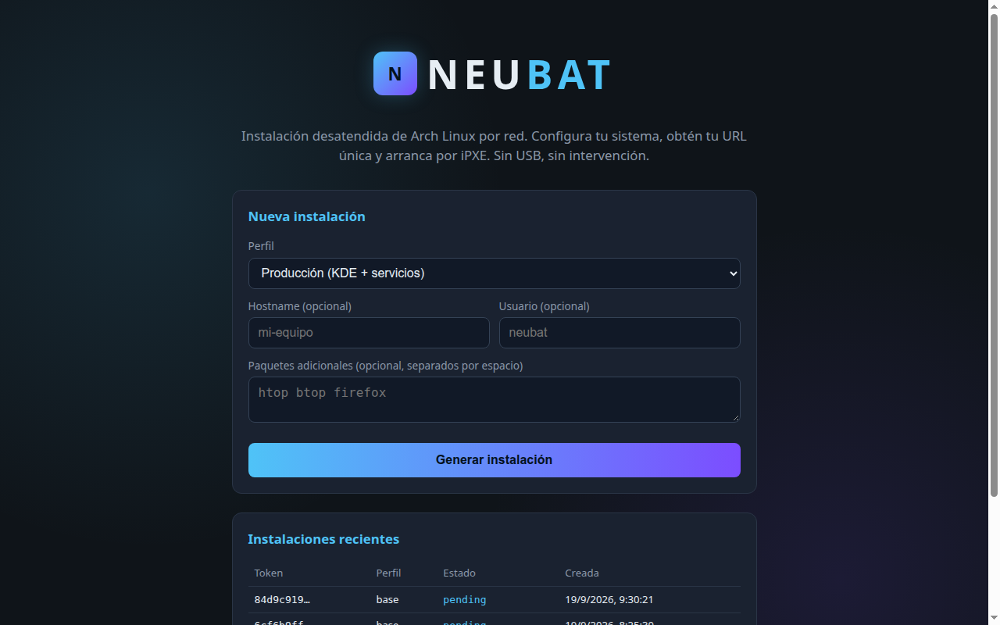

# NEUBAT

**Instalación desatendida de Arch Linux por red (iPXE), con portal web responsive que genera URLs únicas de configuración.**

Versión: 1.0.0 · Arquitectura: x86_64 · Sistema base: Arch Linux (rolling release) · Licencia: GPL-3.0

---

## Concepto

NEUBAT permite desplegar un Arch Linux completo, preconfigurado y funcional **desde Internet, sin medios físicos (USB/CD)**. El usuario define su instalación desde un portal web (móvil o escritorio), obtiene una URL/token único, y la máquina destino arranca por red (iPXE), descarga esa configuración e instala el sistema sin intervención.

Principios:

- **Zero-touch deployment** — cero intervención tras la selección inicial.
- **Infrastructure as Code** — toda la configuración versionada y reproducible (JSON + scripts).
- **Rolling release** — sistema siempre actualizado, sin migraciones traumáticas.
- **Monolito recortado** — sistema mínimo, sin bloatware, optimizado para su propósito.

## Objetivos medibles

| # | Objetivo | Métrica de éxito |
|---|----------|------------------|
| 1 | Portal de usuarios responsive | Accesible desde móvil/desktop, carga < 2 s |
| 2 | URL generada post-instalación | URL única funcional en < 5 min desde el arranque |
| 3 | Instalación desatendida | 0 intervenciones tras la selección inicial |

## Estructura del repositorio

```
neubat/
├── portal/                    # Portal web (Node.js + Express)
│   ├── server.js              # Servidor principal
│   ├── package.json
│   ├── Dockerfile             # Imagen de producción del portal
│   ├── lib/db.js              # Persistencia JSON y utilidades
│   ├── routes/install.js      # API: creación y entrega de configs, boot iPXE
│   ├── routes/admin.js        # API de administración
│   ├── routes/status.js       # API: health y listado de instalaciones
│   ├── frontend/              # SPA React + Vite + shadcn/ui
│   │   ├── src/pages/         # HomePage y AdminPage
│   │   ├── src/components/ui/ # Componentes shadcn/ui
│   │   └── package.json
│   └── public/                # Build estático del frontend + wiki.html
├── netboot/
│   ├── ipxe/neubat.ipxe       # Menú de arranque por red
│   └── grub/loopback.cfg      # Fallback: arranque de ISO desde disco (GRUB loopback)
├── scripts/
│   ├── neubat-install.sh      # Script maestro (orquestador)
│   ├── build-iso.sh           # Generador de ISO híbrida (Docker + archiso)
│   ├── build-iso-inner.sh     # Script interno de construcción de la ISO
│   ├── 00-preinstall.sh       # Validaciones previas
│   ├── 10-partition.sh        # Particionado automático (GPT/UEFI/btrfs, NVMe-safe)
│   ├── 20-archinstall.sh      # Config remota + sistema base (pacstrap)
│   ├── 30-postinstall.sh      # Configuración en chroot + aplicaciones
│   ├── 40-portal-deploy.sh    # Despliegue del portal local + URL única
│   └── validate-install.sh    # Checklist de validación post-instalación
├── configs/
│   ├── base.json              # Perfil mínimo (sin GUI)
│   ├── production.json        # Perfil producción (KDE + servicios)
│   └── developer.json         # Perfil desarrollo (GNOME + toolchains)
├── iso/                       # Overlay del live ISO (servicio de autoinstalación)
│   └── airootfs/
├── deploy/
│   └── pacman-cache/          # Proxy caché nginx de paquetes pacman (opcional)
├── tests/
│   └── vm/                    # Prueba end-to-end QEMU/NVMe (neubat_vm_test.py)
└── docs/
    ├── INSTALL.md             # Documento maestro de instalación y despliegue
    ├── ARCHITECTURE.md        # Arquitectura técnica y diagrama de flujo
    ├── ROADMAP.md             # Próximos pasos
    ├── RELEASE-v1.0.0.md      # Notas de la release v1.0.0
    └── assets/                # Capturas de pantalla
```

## Quickstart

### 1. Portal web (Docker)

```bash
docker compose up -d
# http://localhost:3000
```

O en local con Node.js:

```bash
cd portal/frontend && npm install && npm run build
cd ..
npm install
npm start          # http://localhost:3000
```

Desde el portal se crea una instalación (`POST /api/install`), que devuelve un `token` y una `boot_url` (`/boot/<token>`) con el script iPXE personalizado.

### 2. Arranque por red

Encadena iPXE a:

```
http://<servidor-portal>/boot/<token>
```

o usa `netboot/ipxe/neubat.ipxe` para el menú interactivo.

### 3. ISO híbrida con autoinstalación

Construye la ISO (requiere Docker):

```bash
make build-iso
# out/neubat-1.0.0-x86_64.iso
```

Arranca una máquina con la ISO y pasa el token por kernel cmdline:

```
neubat_token=<token> neubat_profile=production neubat_portal_url=http://<portal>:3000
```

El instalador se ejecuta de forma desatendida y notifica al portal al finalizar.

### 4. Instalación manual (desde el live ISO de Arch)

```bash
export NEUBAT_PORTAL_URL="http://<servidor-portal>"
bash scripts/neubat-install.sh <token> [perfil]
```

> **AVISO:** el instalador **destruye todos los datos** del disco objetivo. Usar solo en máquinas destinadas a ello.

### 5. Validación

Tras el primer arranque:

```bash
bash scripts/validate-install.sh
```

## Documentación

- [docs/INSTALL.md](docs/INSTALL.md) — documento maestro completo
- [docs/ARCHITECTURE.md](docs/ARCHITECTURE.md) — diagrama de flujo y componentes
- [docs/ROADMAP.md](docs/ROADMAP.md) — próximos pasos

## Descarga de la ISO

La release **v1.0.0** incluye la ISO híbrida lista para arrancar:

- [`neubat-1.0.0-x86_64.iso`](https://github.com/Alexendros/neubat/releases/download/v1.0.0/neubat-1.0.0-x86_64.iso) (1.6 GB)
- [`neubat-1.0.0-x86_64.iso.sha256`](https://github.com/Alexendros/neubat/releases/download/v1.0.0/neubat-1.0.0-x86_64.iso.sha256)

Verifica:

```bash
sha256sum -c neubat-1.0.0-x86_64.iso.sha256
```

## Panel de administración

El portal incluye un panel en `/admin` protegido por `ADMIN_TOKEN`. Permite listar, filtrar, resetear, marcar como completadas y eliminar instalaciones.

```bash
ADMIN_TOKEN=tu-token-seguro docker compose up -d
```

Accede a `http://localhost:3000/admin` e introduce el token.

## Captura del portal



## Seguridad

- Las contraseñas iniciales son parametrizables vía JSON; el valor por defecto (`neubat`) **debe cambiarse en el primer acceso**.
- El portal aplica rate-limiting básico en `/api/*`. Para exposición pública, despliega detrás de un reverse proxy con TLS.

## Licencia

[GPL-3.0](LICENSE)
